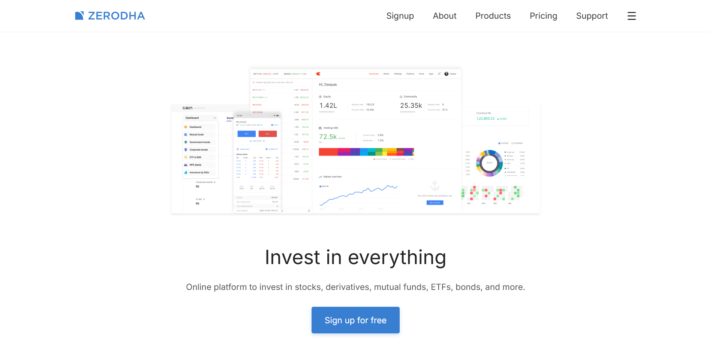

# Zerodha Clone

A high-fidelity, pixel-perfect clone of the **Zerodha** website. This project focuses on replicating the clean, minimalist aesthetic of India's largest stockbroker while ensuring a fully responsive experience across all devices.



## ✨ Features
- **Responsive Navigation**: Includes a custom mega-menu with multi-tier organization (Products, Utilities, Updates, Education).
- **Modern UI/UX**: Replicated Zerodha's branding with custom SVGs, clean typography, and spacious layouts.
- **Mobile Optimized**: Fully adaptive design using Flexbox and CSS Grid that works seamlessly on phones, tablets, and desktops.
- **Interactive Elements**: Smooth transitions, hover states, and dynamic menu toggling using Vanilla JavaScript.
- **Semantic HTML**: Built with accessibility and SEO best practices in mind.

## 📄 Pages Implemented
- **Home (`index.html`)**: The main landing page featuring the hero section, trust indicators, and ecosystem overview.
- **About (`about.html`)**: Company philosophy and team details.
- **Products (`products.html`)**: Overview of the Kite, Console, Coin, and other ecosystem apps.
- **Pricing (`pricing.html`)**: Clear breakdown of equity delivery, intraday, and F&O charges.
- **Support (`support.html`)**: Help portal layout with category-wise support tickets.
- **Signup (`signup.html`)**: Clean user registration interface.

## 🏗️ Project Structure
The project is organized for modularity and easy maintenance:
```text
zerodha/
├── assets/             # Reorganized assets by category
│   ├── brand/          # Logos, favicons
│   ├── home/           # Illustrations for landing page
│   ├── icons/          # Product and feature icons
│   └── pricing/        # Pricing specific SVGs
├── styles/             # Modular CSS files
│   ├── index.css       # Global styles
│   └── navbar.css      # Navigation specific styling
├── index.html          # Main Entry
├── script.js           # Core interactivity logic
└── README.md           # Documentation
```

## 🛠️ Getting Started
To run this project locally:
1. Clone the repository:
   ```bash
   git clone https://github.com/[your-username]/zerodha-clone.git
   ```
2. Navigate to the project directory:
   ```bash
   cd zerodha
   ```
3. Open `index.html` in your browser.

## 💻 Technologies Used
- **Logic**: Vanilla JavaScript (ES6+)
- **Styling**: Vanilla CSS3 (Custom Variables, Flexbox, Grid)
- **Structure**: Semantic HTML5
- **Assets**: SVGs and PNGs sourced from Zerodha for accuracy.
- **Typography**: Inter (Google Fonts)
- **Icons**: Font Awesome 6.5.0

---
*Disclaimer: This project is for educational purposes only. All branding and assets belong to Zerodha.*
